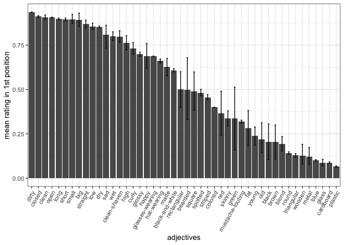
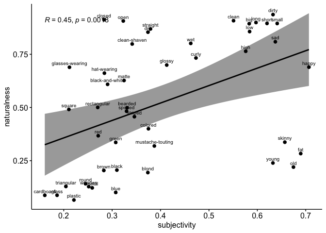
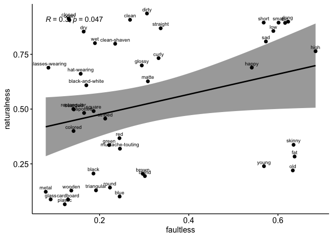
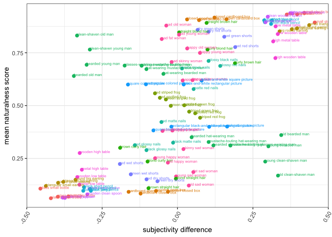

Pragmatics in CTSL - Ordering Preferences (ENGLISH)
================

    ## `summarise()` regrouping output by 'label', 'first_pos' (override with `.groups` argument)

    ## `summarise()` ungrouping output (override with `.groups` argument)

<!-- -->

    ## `geom_smooth()` using formula 'y ~ x'

<!-- -->

    ## Saving 7 x 5 in image
    ## `geom_smooth()` using formula 'y ~ x'
    ## `geom_smooth()` using formula 'y ~ x'

<!-- -->

    ## Saving 7 x 5 in image
    ## `geom_smooth()` using formula 'y ~ x'

    ## Adding missing grouping variables: `adj_noun`

    ## `geom_smooth()` using formula 'y ~ x'

<!-- -->

    ## Saving 7 x 5 in image
    ## `geom_smooth()` using formula 'y ~ x'

    ## `geom_smooth()` using formula 'y ~ x'

<!-- -->

    ## Saving 7 x 5 in image
    ## `geom_smooth()` using formula 'y ~ x'
