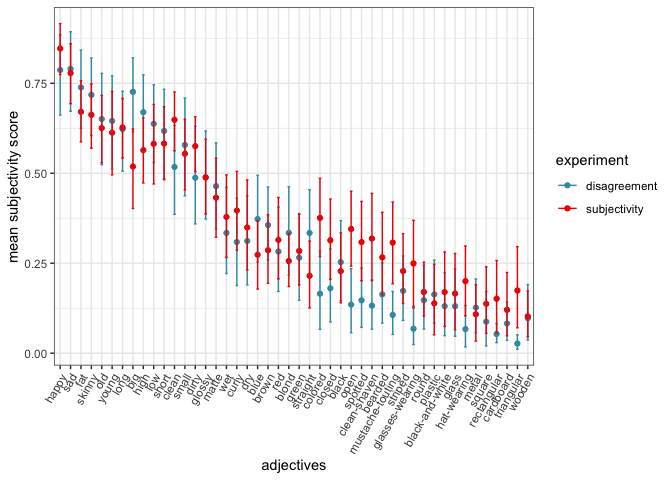
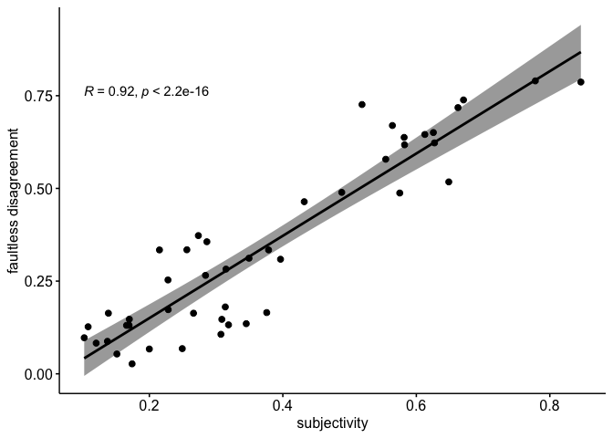

Pragmatics in CTSL - Subjectivity and Faultless Disagreement (TURKISH)
================

    ## `summarise()` regrouping output by 'adj' (override with `.groups` argument)

<!-- -->

    ## `geom_smooth()` using formula 'y ~ x'

<!-- -->

    ## 
    ##  Pearson's product-moment correlation
    ## 
    ## data:  d_wide$subjectivity and d_wide$disagreement
    ## t = 15.655, df = 44, p-value < 2.2e-16
    ## alternative hypothesis: true correlation is not equal to 0
    ## 95 percent confidence interval:
    ##  0.8604578 0.9556245
    ## sample estimates:
    ##     cor 
    ## 0.92076
